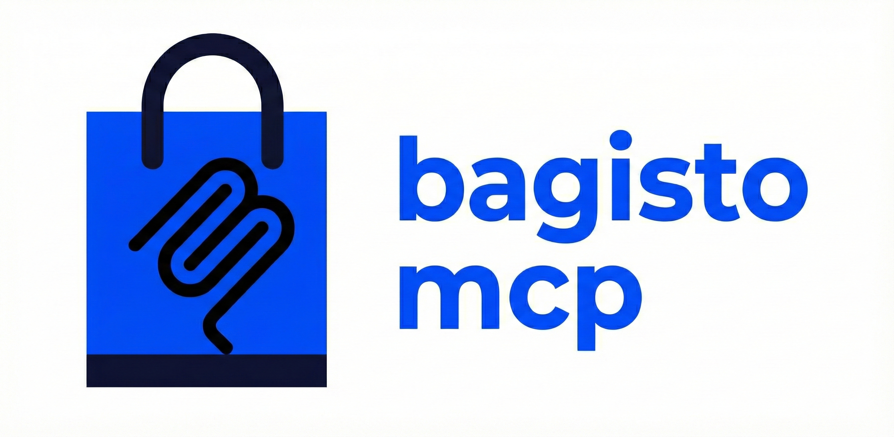

# Bagisto MCP Server
<p align="center">
  
</p>

<!-- Enable/Disable Badge -->
<p align="center">
    <a href="https://github.com/heygeeks/bagisto-mcp/actions"></a>
    <a href="https://packagist.org/packages/heygeeks/bagisto-mcp"></a>
    <a href="https://bgcp.heygeeks.in"></a>
</p>

<h1 align="center">Bagisto MCP Server</h1>

<p align="center">
  <strong>Model Context Protocol for Bagisto E-Commerce</strong>
</p>

A Laravel package that exposes Bagisto e-commerce capabilities to LLMs (Large Language Models) like Claude via the **Model Context Protocol (MCP)**. This enables AI agents to safely interact with your Bagisto store to search products, manage carts, check orders, and more—all controlled via a dedicated Admin Panel.

---

## 📋 Table of Contents

- [Features](#-features)
- [Installation](#-installation)
- [Configuration](#-configuration)
- [Admin Panel](#-admin-panel)
- [Claude Desktop Integration](#-claude-desktop-integration)
- [Available Tools](#-available-tools)
- [Contributing](#-contributing)

---

## 🚀 Features

- **Native PHP MCP Server**: Runs directly within your Laravel application using `stdio`.
- **Admin Panel Integration**: Enable/Disable tools and manage settings directly from the Bagisto Admin.
- **Granular Control**: Toggle individual tools like `products.search` or `customer.profile`.
- **Authentication**: Secure sensitive tools with token-based authentication (Sanctum).
- **Dual Transport**: Supports both Local Stdio (for Claude Desktop) and HTTP Endpoint methods.

---

## 📦 Installation

### 1. Install via Composer

```bash
composer require heygeeks/bagisto-mcp
```

### 2. Publish Assets & Configuration

Publish the configuration file and database migrations:

```bash
php artisan vendor:publish --provider="HeyGeeks\BagistoMCP\MCPServiceProvider"
```

### 3. Run Migrations

Create the necessary database tables for tool settings:

```bash
php artisan migrate
```

### 4. Clear Caches

Ensure the new routes and config are loaded:

```bash
php artisan route:clear
php artisan config:clear
```

---

## ⚙️ Configuration

The main configuration file is located at `config/mcp.php`.

```php
return [
    'enabled' => true,           // Master switch for the MCP server
    'endpoint' => 'mcp',         // HTTP Endpoint (e.g., yourstore.com/mcp)
    'auth' => 'sanctum',         // Auth method for protected tools
    'tools' => [                 // Registered Tool Classes
        'products.list' => \HeyGeeks\BagistoMCP\Tools\ProductListTool::class,
        // ...
    ],
];
```

---

## 🖥️ Admin Panel

Manage your MCP Server directly from the Bagisto Admin Panel.

1.  Log in to your **Bagisto Admin**.
2.  Navigate to **MCP** in the sidebar.
3.  **Dashboard**: View server status and tool statistics.
4.  **Settings**: Configure global settings like Rate Limiting and Endpoint URL.
5.  **Tools**: Toggle individual tools On/Off and configure their specific settings.

> **Note**: If you disable a tool in the Admin Panel, it will immediately become unavailable to connected LLMs.

---

## 🤖 Claude Desktop Integration

To use Bagisto MCP with Claude Desktop, you need to configure it to run the PHP server script.

### 1. Locate the Server Script

The server script is located at:
`packages/heygeeks/bagisto-mcp/bin/server.php`
(or inside `vendor/heygeeks/bagisto-mcp/bin/server.php` if installed via vendor)

### 2. Edit Claude Config

Edit your Claude Desktop configuration file:
- **macOS**: `~/Library/Application Support/Claude/claude_desktop_config.json`
- **Windows**: `%APPDATA%\Claude\claude_desktop_config.json`

Add the following configuration:

```json
{
  "mcpServers": {
    "bagisto": {
      "command": "php",
      "args": [
        "/ABSOLUTE/PATH/TO/YOUR/PROJECT/packages/heygeeks/bagisto-mcp/bin/server.php"
      ]
    }
  }
}
```

**Important**: Replace `/ABSOLUTE/PATH/TO/YOUR/PROJECT` with the actual full path to your Laravel project root.

### 3. Restart Claude

Restart Claude Desktop. You should see the Bagisto tools (e.g., `products_search`, `store_info`) available in the tool picker.

---

## 🌐 Public Access (HTTP/SSE)

If you need to expose the MCP server to users who cannot use SSH, you can use the **HTTP Endpoint**. This allows clients to connect via Server-Sent Events (SSE).

### Endpoint URL

The default endpoint is:
`https://your-store.com/mcp`

(You can change the `/mcp` prefix in `config/mcp.php`)

### Client Connection

To connect standard MCP clients (like Claude Desktop) to the HTTP endpoint, you need a local bridge script because Claude only supports local commands.

We provide a Node.js bridge script in `packages/heygeeks/bagisto-mcp/client/`.

#### 1. Setup the Client Bridge
```bash
cd packages/heygeeks/bagisto-mcp/client
npm install
```

#### 2. Configure Claude Desktop
Edit your `claude_desktop_config.json`:

```json
{
  "mcpServers": {
    "bagisto-http": {
      "command": "node",
      "args": [
        "/ABSOLUTE/PATH/TO/bagisto-mcp/client/remote-client.js",
        "https://your-store.com/mcp"
      ]
    }
  }
}
```

(If you have an auth token, pass it as the second argument: `"args": [..., "https://url...", "YOUR_TOKEN"]`)

### Security Warning

> [!WARNING]
> Exposing the MCP server publicly allows anyone to query your product catalog.
> - **Authentication**: By default, the endpoint is public but sensitive tools require tokens.
> - **HTTPS**: Always use HTTPS for the remote URL.

---

## 🔒 Remote Server Usage (SSH Tunneling)

For **Admins and Developers**, the recommended secure method is to use **SSH Tunneling**.

### Configuration (Claude Desktop)

Update your local `claude_desktop_config.json`:

```json
{
  "mcpServers": {
    "bagisto-ssh": {
      "command": "ssh",
      "args": [
        "user@your-server.com",
        "php",
        "/var/www/html/bagisto/packages/heygeeks/bagisto-mcp/bin/server.php"
      ]
    }
  }
}
```

### Important Notes for SSH

1.  **User Permissions**: Run as a user with read access to the project.
2.  **Encryption**: Traffic is fully encrypted via SSH.

---

## 🛠️ Available Tools

| Category | Tool Name | Description | Auth |
|----------|-----------|-------------|------|
| **Products** | `products.list` | List products with filtering | ❌ |
| | `products.search` | Full-text search for products | ❌ |
| | `products.detail` | Get product details by ID/SKU | ❌ |
| **Categories** | `categories.list` | List all product categories | ❌ |
| **Customer** | `customer.login` | Authenticate customer | ❌ |
| | `customer.profile` | Get customer profile | ✅ |
| **Orders** | `orders.status` | Check order status | ❌ |
| | `orders.history` | View order history | ✅ |
| **Cart** | `cart.preview` | View current cart | ❌ |
| **Store** | `store.info` | Get store configuration | ❌ |
| **Wishlist** | `wishlist.view` | View customer wishlist | ✅ |

---

## 🤝 Contributing

We welcome contributions!

1.  Fork the repository.
2.  Create a feature branch.
3.  Submit a Pull Request.

## 📄 License

MIT License. See [LICENSE](LICENSE) for details.

